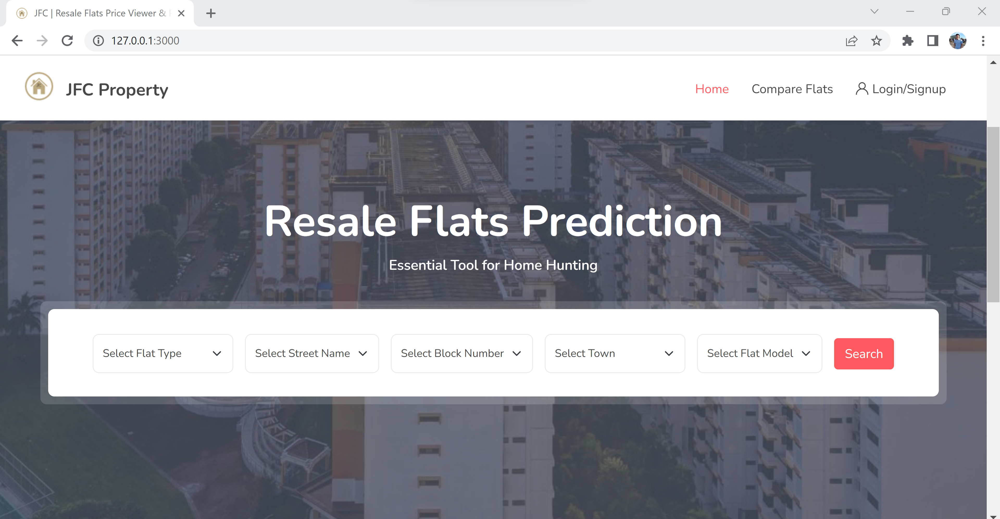
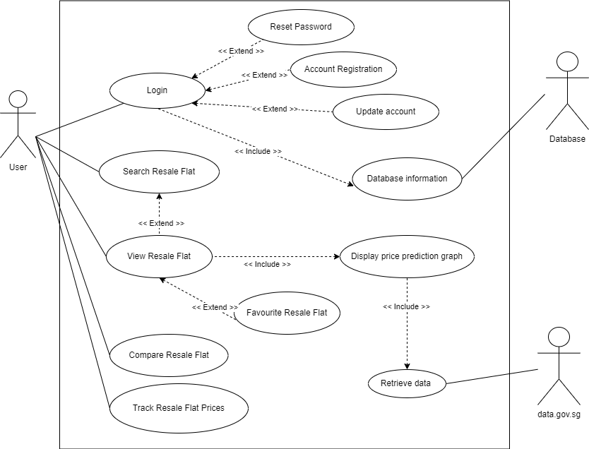
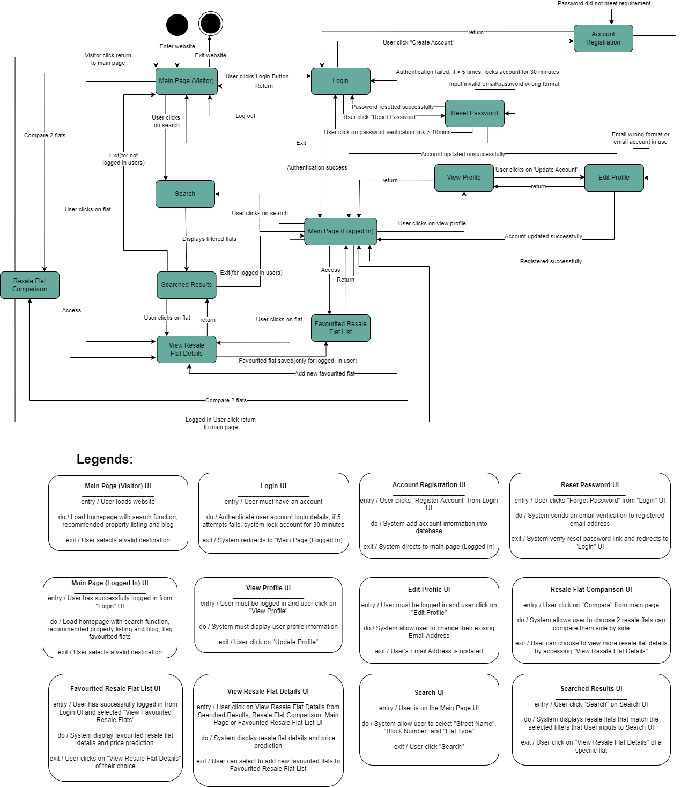

# SC2006 Software Engineering
# JFC Property
JFC aims to create an application that predicts future prices of HDB resale flats in Singapore. This would benefit potential house-buyers by providing insights for the best time to buy or sell a resale flat, or if they are interested to compare between future house prices.

# Product Perspective
Our product is a web application designed for homebuyers and home investors to search, view and track resale flats in the Singapore market. The application fetches data from data.gov.sg and uses machine learning models to predict future resale prices via Multivariate Time Series Forecasting with LSTMs. This application is a standalone product, but it will be integrated with external data sources and may potentially interface with other real estate platforms.

# Product Functions
<ul>
  <li>User Account (Login, Registration, Reset Password, My Profile and Change User Profile)</li>
  <li>Search for resale flats based on various parameters</li>
  <li>Display detailed information about selected resale flats</li>
  <li>Display price prediction graphs for resale flats</li>
  <li>Compare two different resale flats</li>
  <li>Allow users to favourite and track resale flats (For registered user)</li>
</ul>  

# Design and Implementation Constraints
<ul>
  <li>Data accuracy which is updated on a monthly basis by data.gov.sg</li>
  <li>Compliance with data privacy and security regulations</li>
  <li>Use of specific backend frameworks and libraries</li>
</ul>  

# Use Case Diagram

# Dialog Map

# References
<ul>
  <li>Data Gov API - https://data.gov.sg/dataset/resale-flat-prices</li>
  <li>How To Build a To-Do application Using Django and React - https://www.digitalocean.com/community/tutorials/build-a-to-do-application-using-django-and-react</li>
 <li>Django + Next.js The Easy Way - https://medium.com/@danialkeimasi/django-next-js-the-easy-way-655efb6d28e1</li>
 <li>181 - Multivariate time series forecasting using LSTM - https://www.youtube.com/watch?v=tepxdcepTbY</li>
 <li>How to connect Django to ReactJs - https://dev.to/nagatodev/how-to-connect-django-to-reactjs-1a71</li>
</ul>
